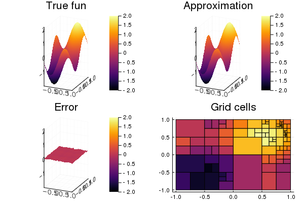

# KalmanTree.jl
*Not yet ready for consumption*

This is so far a toy project. The goal is to develop a function approximator particularily suitable for representing value functions `Q(s,a)` (from control and reinforcement learning). Key points are that the approximator is easy to update recursively and to take the `argmaxₐ(Q)` of.

The approximator consists of a KD-tree, where each cell is a quadratic model. The models are updated recursively once a new datapoint is available. Every now and then, the cell/model with highest covariance (in some sense) is split into two new cells/models.

